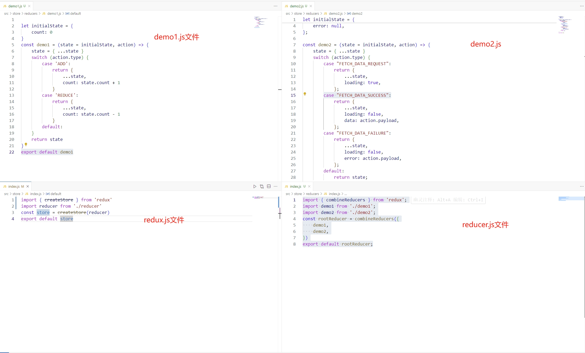
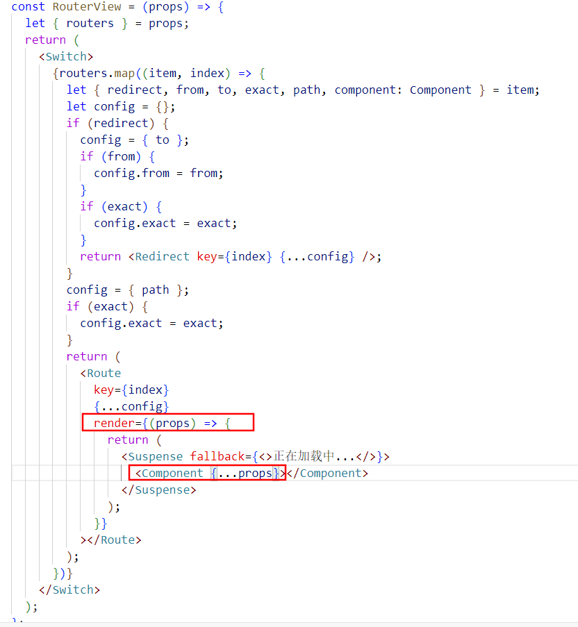
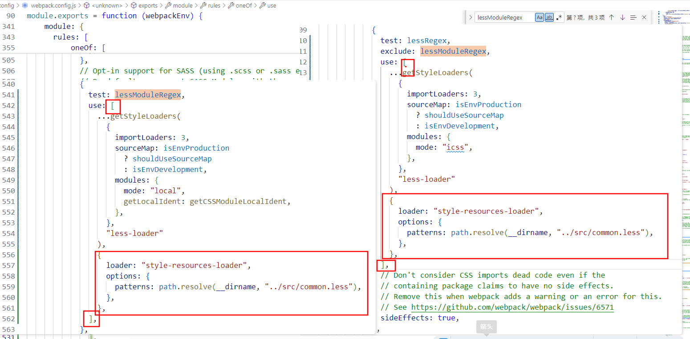
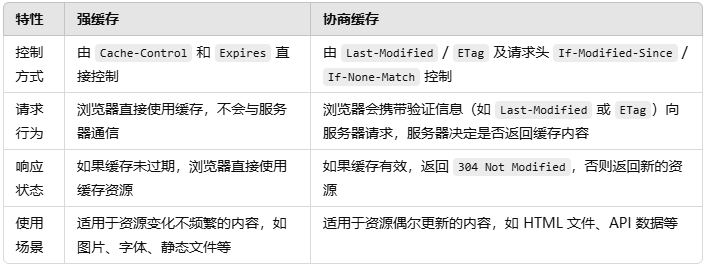
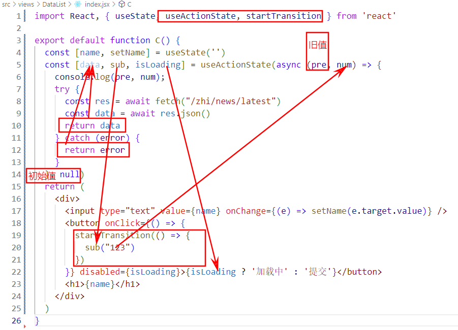
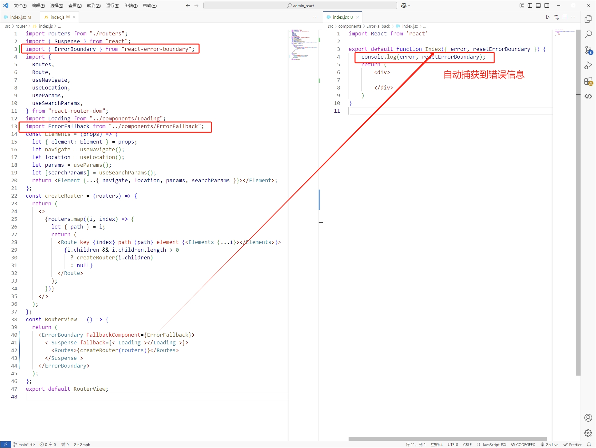

### 2025React

##### 一，创建React脚手架

```
命令 npx create-react-app 项目名称
命令 treer -i "node_modules" 获取项目文件树
├─src
|  └index.js
├─scripts
|    ├─build.js									后期执行相关打包命令的入口文件
|    ├─start.js									
|    └test.js
├─public
|   ├─favicon.ico
|   ├─index.html
|   ├─logo192.png
|   ├─logo512.png
|   ├─manifest.json
|   └robots.txt
├─config
|   ├─env.js
|   ├─getHttpsConfig.js
|   ├─modules.js	
|   ├─paths.js									打包中需要的一些路径管理
|   ├─webpack.config.js							打包规则配置
|   ├─webpackDevServer.config.js				webpackDevServer的配置
|   ├─webpack
|   |    ├─persistentCache
|   |    |        └createEnvironmentHash.js
|   ├─jest
|   |  ├─babelTransform.js
|   |  ├─cssTransform.js
|   |  └fileTransform.js

```

##### 二，配置less less-loader 插件

```
pnpm i less less-loader@8 
在webpack.config.js配置less less-loadder插件	
找到了原本的sass处理路径修改成less
1.
    const sassRegex = /\.(scss|sass)$/;
    const sassModuleRegex = /\.module\.(scss|sass)$/;
    替换
    const lessRegex = /\.less$/;
    const lessModuleRegex = /\.module\.less$/;

2.
	找到webpackEnv的函数，找到module模块
 	sassRegex以及sassModuleRegex  替换lessRegex以及lessModuleRegex
```

##### 三，配置别名

```
在webpack.config.js找到webpackEnv的函数，找到resolve模块下的alias对象添加
"@":paths.appSrc
```

##### 四，修改启动域名以及端口号

```
在start.js文件中找到
1.
    const DEFAULT_PORT = parseInt(process.env.PORT, 10) || 3000;
    const HOST = process.env.HOST || '0.0.0.0';
    替换
    const DEFAULT_PORT = parseInt(process.env.PORT, 10) || 8080;
	const HOST = process.env.HOST || '127.0.01';
通过环境变量修改
下载插件 cross-env
在package.json中找到scripts启动命令处
1.
    "start": " node scripts/start.js",
     替换
    "start": "cross-env PORT=8080 node scripts/start.js",
```

##### 五，修改浏览器兼容

```
在index.js入口文件中添加
import "react-app-polyfill/stable";
import "react-app-polyfill/ie11";
import "react-app-polyfill/ie9";
以及兼容ie11 ie9  stable
```

##### 六，跨域代理

```js
在src下创建setupProxy.js文件
安装插件 pnpm i http-proxy-middleware
在setupProxy.js书写以下代码


1.http-proxy-middleware 2.0版本


    const { createProxyMiddleware } = require("http-proxy-middleware");
    module.exports = function (app) {
      app.use(
        createProxyMiddleware("/jian", {
          target: "https://www.jianshu.com/asimov",
          changeOrigin: true,
          ws: true,
          pathRewrite: {
            "^/jian": "",
          },
        })
      );
      app.use(
        createProxyMiddleware("/zhi", {
          target: "https://news-at.zhihu.com/api/4",
          changeOrigin: true,
          ws: true,
          pathRewrite: {
            "^/zhi": "",
          },
        })
      );
    };


2.http-proxy-middleware 3.0版本

const { createProxyMiddleware } = require("http-proxy-middleware");
module.exports = function (app) {
  app.use(
    "/jian",
    createProxyMiddleware({
      target: "https://www.jianshu.com/asimov",
      changeOrigin: true,
      pathRewrite: {
        "^/jian": "",
      },
    })
  );
  app.use(
    "/zhi",
    createProxyMiddleware({
      target: "https://news-at.zhihu.com/api/4",
      changeOrigin: true,
      pathRewrite: {
        "^/zhi": "",
      },
    })
  );
};
```

##### 七，React，Vue，Anglar(NG)

```
主流思想：
	不直接操作DOM,数据驱动视图
	数据发生改变时，会让页面刷新
		构建了一套虚拟DOM到真实DOM的渲染体系
		有效避免了DOM的重排和重绘
操作DOM:
	操作DOM比较消化性能（可能会导致DOM重排/重绘）

React框架采用的是MVC体系；Vue框架采用的是MVVM体系
```

##### 八，MVC

```
MVC：model数据层 + view视图层 + controller控制层
	 数据层受到改变那么视图层则会刷新页面，视图层操作按钮等改变数据，则会通过React合成事件监听到，然后写业务		逻辑改变数据
	 ***单向数据驱动***
```


##### 九，MVVM

```
MVVM:model数据层 + view视图层 + vievModel数据/视图监听层
	**双向驱动**
```


##### 十，JSX构建视图的基础知识

```
JSX：javaScript and html（xml）把js和HTML标签混合在一起
```

##### 十一,React基础渲染过程

```
通过ReactDom.createRoot获取到index.html的root元素
在使用reder方法渲染进去
```

##### 十二，稀疏数组以及密集数组

```
稀疏数组：数组的每一项都为空，无法使用数组的自身的循环方法，可以使用fill填充为密集数组
密集数组：数组的每一项都是一个真实的值
```

##### 十三，关于JSX底层处理机制

```jsx
1.把我们编写的JSX语法，编译为虚拟DOM对象（virtualDOM）
	虚拟DOM对象：框架自己内部构建的一套对象体系（对象相关成员都是React内部规定的），基于这些属性描述出，	  	  我们所构建视图中的DOM节点相关特征
	
	@1 基于bael-peset-react-app 把jSX编译为React.createElement(...)格式
	@2 再把createElement方法执行，创建出虚拟DOM
                                                         
	jsx语法
	<div id="app">Hello, <span>world!</span></div>;
	转换
	React.createElement(
      'div',
      {
         id: 'app',
      },
        "Hello,",
         React.createElement("span",null，world!)                                             
    )
    
	React.createElement函数:
    参数1:标签(组件)名称，参数2：标签属性对象(无属性为Null)，参数3以及后面参数：标签子节点
    
	React.createElement函数函数返回值：虚拟DOM对象(4个属性)
	key:循环渲染所需要的key值
    props对象：存放自身的属性和内容以及子节点存放在children
    ref：
    type：标签名称
    
    手写简单的createElement方法
    export function createElement(ele, props, ...children) {
              let virtualDom = {
                $$typeof: Symbol("react.element"),
                key: null,
                props: {},
                ref: null,
                type: ele,
              };
              let len= children.length;
              if (props !== null) {
                virtualDom.props = {
                  ...props,
                };
              }
              if(len===1) virtualDom.props.children = children[0];
              if (len > 1) virtualDom.props.children = children;
              return virtualDom;
        }
    

2.把构建的虚拟DOM渲染为真实DOM
	真实DOM：浏览器页面中，最后渲染出来，让用户看见的DOM元素！！！
    
    React16版本：
    React.render(
    	<>...</>,
        documen.getElementById('root')
    )
	
    React18版本：
    const root = ReactDOM.createElement(document.getElementByid('root'))
    root.render(
    	<>...</>
    )
    
	手写简单的render方法
    // 模拟基础render：将虚拟dom对象
    export function render(virtualDom, container) {
  let { type, props } = virtualDom;
  if (typeof type === "string") {
    // 创建一个标签
    let ele = document.createElement(type);
    // 将属性添加到标签上以及子节点
    eachObject(props, (key, value) => {
      // className的处理
      if (key === "className") {
        ele.className = value;
        return;
      } else if (key === "style") {
        // 样式的处理
        eachObject(value, (styleKey, styleValue) => {
          ele.style[styleKey] = styleValue;
        });
        return;
      } else if (key === "children") {
        // 处理子节点
        let children = value;
        if (!Array.isArray(children)) children = [children];
        children.forEach((child) => {
          if (/^(string|number)$/.test(typeof child)) {
            ele.appendChild(document.createTextNode(child));
            return;
          }
          render(child, ele);
        });
        return;
      }
      ele.setAttribute(key, value);
    });
    container.appendChild(ele);
  }
}

补充说明：第一次渲染页面是直接从虚拟DOM转为真实DOM，但是后期更新的时候，需要经过diff算法对比，对比出新旧DOM树的差异部分，然后渲染出差异的虚拟DOM

JSX语法无法渲染对象，但是可以通过React.createElement("button",{ className: "btn" }, "按钮")渲染一个对象
```


##### 十四，封装一个简单的迭代对象方法

```jsx
/*
  封装一个对象迭代的方法
  for/in方法。只能迭代可枚举 非Symbol类型的属性(不建议使用)，而且会迭代公有的和私有的，性能较差
  使用Object.getOwnPropertyNames()  ==>  获取对象所有的私有属性 （私有的）
  使用Object.getOwnPropertySymbols() ==> 获取对象所有的Symbol类型的属性
  Object.getOwnPropertyNames(arr).concat(Object.getOwnPropertySymbols(arr))
  等同于上方方法，但是不兼容IE
  Object.ownKeys();
  Reflect.ownKeys()
*/

export function eachObject(obj, callback) {
  // 判断obj是否是对象
  if (obj === null || typeof obj !== "object")
    throw new TypeError(obj + " is not an object");
  // 判断callback是否是函数;
  if (typeof callback !== "function")
    throw new TypeError(callback + " is not a function");
  let keys =   Reflect.ownKeys(obj);
  keys.forEach((key) => {
    callback(key, obj[key]);
  });
}
```

##### 十五，函数组件渲染的机制

```jsx
@1 基于bale-presset-react-app把调用的组件转换为createElement格式
@2 再把createElement方法执行，创建出虚拟DOM

    React.createElement(DemoOne, {
          title: "demo",
          x: 10,
          className: "demo",
          style: {
            fontSize: "20px"
          }
    });

	转换为虚拟DOM对象
    {
        $$typeof:Symbol(react.element),
        key:null,
        ref:null,
        props:{ title: "demo",
          x: 10,
          className: "demo",
          style: {
            fontSize: "20px"
          }},
        type:DemoOne
    }
@3通过rendr方法把虚拟DOM变为真实DOM
 
	转换过程中会把函数执行
    把虚拟DOM的props作为实参传递给函数
    最后把函数执行的返回结果基于rendr方法转为真实DOM,最后转为真实DOM
    
```

##### 十六，函数组件props相关细节处理

```
@1只读，不允许修改
	对象本身可设置规则：冻结，密封，不可扩展
	
	冻结：
		Object.freeze(obj),无法修改，无法新增，无法删除以及无法做劫持。
		Object.freeze(obj)冻结只是浅冻结，无法做到深冻结，只能递归
		检测对象是否被冻结 Object.isFrozen(obj)。
		
	密封：
		Object.seal(obj)无法新增，无法删除，可修改，不可被劫持
		Object.seal(obj)密封只是浅密封，无法做到深密封，只能递归
		检测对象是否被密封 Object.isSealed(obj)
		
	不可扩展：
		Object.preventExtensions(obj)可修改可删除不可新增，可被劫持
		Object.preventExtensions()不可扩展也是浅层的
		检测对象是否被不可扩展 Object.isExtensible(obj)
	
	设置props的属性默认值：
		函数组件.defaultProps={
			key：value
		}
		
	设置props的属性规则：
		使用插件prop-types
		improt PropTypes fome "prop-types"
        函数组件.propTypes={
            key:PropTypes.string.isRequired  //类型：字符串 必传
            key:PropTypes.number			 //类型：数字 不必传
        }
```

##### 十七，关于函数组件的插槽机制

```jsx
 使用props.children 
 
 默认插件
 父组件： 
 	import Son from "./son"
 	function  Father(){
 		return (
        	<>
            	<Son>
                	<div>123</div>
            	</Son>
            	<Son>
            		<div>123</div>
                	<div>456</div>
            	</Son>
            </>
        )
 	}
 	exprot default Father
 
 子组件：
 	function  Son(props){
 		return (
 			<>
 				<div></div>
            	{props.children}
 			</>
 		)
 	}
 	exprot default Father

对props.childern进行判断拆开使用

	使用React.Children.toArray(children)内置方法转为数组
    
	improt React from 'react'
    function  Son(props){
        let children = React.Children.toArray(props.children)
            return (
                <>
                 	{children[1]}
                    <div>456</div>
                    {children[0]}
                </>
            )
        }
 	exprot default Father

具名插槽
	 父组件： 
 	import Son from "./son"
 	function  Father(){
 		return (
        	<>
            	<Son>
            		<div slot="header">123</div>
                	<div>456</div>
                	<div slot="footer">789</div> 
            	</Son>
            </>
        )
 	}
 	exprot default Father
 
 子组件：
	improt React from 'react'
 	function  Son(props){
    let children = React.Children.toArray(props.children)
    let header=[]
    let default=[]
    let footer=[]
    children.foeEach(i=>{
        if(i.props.slot==="header"){
           header.push(i) 
        }else if(i.props.slot==="footer"){
            default.push(i) 
        }else{
            footer.push(i) 
        }
    })
 		return (
 			<>
 				<div></div>
            	{props.children}
 			</>
 		)
 	}
 	exprot default Father
```

##### 十八，静态组件以及动态组件

```
函数组件是"静态组件"：
	第一次渲染组件，把函数执行
        产生一个私有的上下文
        把解析出来的props(含children)传递进来（但是被冻结了）
        对函数返回的JSX元素虚拟DOM对象进行渲染
    当我们去修改数据的时候
    	修改上级上下文的变量
    	私有变量会发生改变
    	但是视图不会更新
    	
类组件以及Hooks组件都属于动态组件
	render函数在渲染的时候，如果type是new 开头的，则会用new创建一个类的实例执行，也会把props传递过去

```

##### 十九，Hooks组件

```
Hooks组件是React16.8后开始提供的
```

##### 二十，安装antd，配置中文包

```jsx
安装命令 pnpm i antd

配置中文以及配置日历中文，需要安装dayjs
	安装命令 pnpm i dayjs
	
在入口文件配置
	import React from "react";
    import ReactDOM from "react-dom/client";
    import "@/index.less";
    import App from "@/App";
    import { ConfigProvider } from "antd";
    import zhCN from "antd/locale/zh_CN";
    import "dayjs/locale/zh-cn";
    const root = ReactDOM.createRoot(document.getElementById("root"));
    root.render(
      <>
        <ConfigProvider locale={zhCN}>
          <App/>
        </ConfigProvider>
      </>
    );
```

##### 二十一,useState

```jsx
hooks组件每次更新视图：
	都是把函数重新执行一次，会产生全新私有上下文
	内部的代码都需要重新执行一次
	
useState更新过程：
   首先Hooks组件会创建两个全局变量，一个空数组，一个索引值初始值为0
   当我们每次调用useState的时候，
   执行过程中首先useState会把索引存储下来，
   在把useState接收的值按照索引值放进去，
   如果接收的值是函数就会执行函数，把函数返回值重新赋给接收的形参
   在对全局索引值加1，最后返回状态值以及修改状态方法
   调用修改状态方法的可以传值也可以转回调函数
   执行的时候首先会判断形参是否是一个函数，是函数就执行，
   把函数的返回值重新赋给形参，再根据保存下来的索引值，
   更新数组对应的值，然后再异步通知渲染视图
   
当调用useState返回的修改状态方法后，后面接着输出状态值还是旧的的值
因为找到的变量是它的上级上下文

useState返回的修改状态方法：
	在react18中是异步的，会有一个更新队列，实现状态的批处理,队列所有的状态函数执行完成后刷新视图
    	//执行一次
        const handle = ()=>{
            setXXX(XXX)
            setXXX(XXX)
        }
        
	在React-dom中有一个flushSync方法可以改变成同步的,
			//执行两次
            const handle = ()=>{
                flushSync(()=>{
                    setXXX(XXX)
                })
                setXXX(XXX)
            }
    在React16种可以放在定时器里面执行变成同步的
            //执行两次
            setTimeout(()=>{
                setXXX(XXX)
                setXXX(XXX)
            },1000)

useState修改状态值后拿到最新的值2种常用方法
	1.用useEffect
	2.调用状态修改方法传回调函数
		setXXX((v)=>{
			let newVal = v+1 
			return newVal
		})

```


##### 二十二，useState的优化机制

```
useStart修改状态方法在循环for/in中使用flushSync，不管循环几次都只会hooks组件都只会执行两次，
	如果不使用flushSync则只会执行一次
	原因：
    	因为useState每次修改的状态值的时候都会把修改的值与原来的值作比较(基于Object.is方法)，
        当他发现修改的值与原来的值相同时则不会重新执行hooks组件
        
但是setXXX()参数接收的是一个函数那么使用flushSync，hooks组件则会执行循环的次数
如果不是flushSync也只是执行一次，但是最后得到状态值不相同

都不使用flushSync情况下
	cosnt [x,setX] = useState(1)
	for(let i = 0;i<10;i++){
		setX(x+1)
	}
	hooks组件执行一次，x输出为2
	for(let i = 0;i<10;i++){
		setX((v)=>{
			return v+1
		})
	}
	hooks组件执行一次，x输出为11
	
都使用flushSync情况下
	for(let i = 0;i<10;i++){
		flushSync(()=>{
			setX(x+1)
		})
	}
	hooks组件执行两次，x输出为2
	for(let i = 0;i<10;i++){
		flushSync(()=>{
			setX((v)=>{
				return v+1
			})
		})
	}
	hooks组件执行10次，x输出为11
```


##### 二十三，手写简单的useState Hooks函数

```jsx
// 模拟一个简单useState

/*
*_state：存储状态
*_index：存储索引值
*/
let _state = [],
  _index = 0;
// 通知更新视图
let defer = (cb) => Promise.resolve().then(cb);
export function useState(initialState) {
  // 储存对应的索引值
  let currenIndex = _index
  if (typeof initialState === 'function') {
    initialState = initialState()
  }
  _state[currenIndex] = _state[currenIndex] || initialState;
  let setState = (newState) => {
    // 如果是函数更新
    if (typeof newState === 'function') {
      newState = newState(_state[currenIndex])
    }
     if(！Object.is(_state[currenIndex],newState)){
           _state[currenIndex] = newState;
    		defer(renderComponent)
     }
  }
  _index += 1;
  return [_state[currenIndex], setState]
}
```

##### 二十四。useEffect

```jsx
useEffect函数可以接收2参数
	参数1：回调函数，参数：数组（可以不传）
	
useEffect(()=>{})
	会在hooks组件任何时候执行
	
useEffect(()=>{}，[])
	只会在hooks组件第一次加载的时候执行
	
useEffect(()=>{}，[某个状态值])
	会在hooks组件第一次加载时执行，同时数组种的状态值发生变化也会执行
	
useEffect(()=>{
	return ()=>{
	
	}
})
	返回的函数会在组件释放的时候执行

useEffect(()=>{
	return ()=>{
		
	}
}，[])
	离开组件的时候会执行
	
useEffect(()=>{
	return ()=>{
		
	}
}，[某个状态值])
	依赖发生变化以及离开组件的时候会执行
```

##### 二十五，useEffect执行原理以及细节

```
执行原理：

    在hooks函数第一次执行时，
    hooks函数所有的useEffect都会被React内部的一个MountEffect方法把所有的useEffect的回调函数以及依赖性放进一个链表中，
    当视图渲染完毕后，又会通过React内部的一个UpdateEffrct方法通知链表中所有的回调函数按要求执行，
    如果useEffect的回调函数返回的是一个函数那么这个被返回的函数则会在hooks组件释放前执行
    
细节：
	useEffect函数只能在hooks函数下调用，
	useEffect的返回值必须是一个函数，所有回调函数不能是async函数
	
```


##### 二十六，useLayouEffect

```
与useEffect运行原理基本一致，但是useLayouEffect会比useEffect更早
```


##### 二十七，useRef  与  React.forwardRef  以及  useImperativeHandle

```jsx
useRef与React.cerateRef区别：
	1.useRef在hooks组件二次更新的时候获取的以及是之前的DOM,不会重复获取
	2.React.cerateRef在hooks组件二次更新的时候会重新获取DOM
	
useRef配合React.forwardRef获取子组件元素,直接使用useRef在子组件上会报错
	子组件：
		conts Son = React.forwardRef(funtion Son(props,ref)=>{
			return <div>
				   		<span ref={ref}>子组件</span>
				   </div>
		})
	父组件：
		conts Fa = ()=>{
			let n = useRef()
			return <>
						<Son ref={n}/>
				   </>
		}

使用useRef和React.fowardRef以及useImperativeHandle完成子父组件传参
		子组件：
		conts Son = React.forwardRef(funtion Son(props,ref)=>{
			useImperativeHandle(ref,()=>{
				return {
					子组件的方法或者参数
				}
			})
			return <div>
				   		<span ref={ref}>子组件</span>
				   </div>
		})
	父组件：
		conts Fa = ()=>{
			let n = useRef()
			console.log(n.current)
			return <>
						<Son ref={n}/>
				   </>
		}
		
	
 React.forwardRef用法：
 		一个参数：一个Hooks组件，Hooks组件可以多接收到一个Ref
 		const Son = React.forwadrRef((props,ref)=>{
 			return <></>
 		})
 		
useImperativeHandle用法：
	两个参数：参数1（接收到的Ref）,参数2:回调函数，返回想要暴露的属性与方法
	const Son = React.forwadrRef((props,ref)=>{
	
            useImperativeHandle(ref,()=>{
                return {
                    方法或者属性
                }
            })
            
 		return <></>
 	})


```

##### 二十八，React的合成事件

```
React内部基于浏览器合成的事件

事件具备传播机制：
	第一步：从最外层向最里层逐一查找（捕获阶段:分析出路劲）
	第二步：把事件源（触发事件的元素）的触发行为（目标阶段）
	第三步：按照捕获阶段分析出来的路径，从里到外，把每个元素相同的事件行为触发
	阻止事件传播的两个方法
	ev.stopPropagation():阻止事件的传播（包括捕获和冒泡）
	ev.stopImmediatePropagtion（）：也可以阻止事件传播，只不过它可以把当前元素其他的事件，没有执行的也									 不会执行了
	
事件委托：
	利用事件的传播机制，实现一套事件绑定处理方案
	
	优势：
	提高JS代码的运行性能，并且把处理的逻辑都集中在一起
	在一定的需求上需要基于事件委托
	给动态绑定的元素做事件绑定

React两种绑定事件的方式以及区别：
	1.onXxx
	2.onXxxCapture
	
	第一种是绑定在冒泡阶段
	第二种是绑定在捕获阶段
	所以一个元素同时用这个两个绑定一个事件，那么第二种会先执行

合成事件：
	绝对不是给当前元素基于addEventListener单独做的事件绑定，
	React的合成事件都是基于事件委托处理的
	在React17及以后都是委托#root这个容器（捕获和冒泡都做了委托）
	在React17以前都是委托document容器（只做了冒泡阶段的委托）
	只对有事件传播机制的事件做了委托

在组件渲染的时候，如果发现JSX元素中有onXxx/onXxxCapture这样的属性，
不会给当前元素直接做事件绑定，只是把绑定的方法赋值给元素的相关属性

例如：
	xxx.onClick=()=>{}
	xxx.onClickCapture=()=>{}
    在元素上添加了属性为xxx.onClick,属性值是一个事件
    然后对#root这个容器做事件绑定（捕获和冒泡都做了）
    原因：是因为组件中所有渲染的内容，最后都会插入#root容器中，
    这样点击页面中任何一个元素，最后都会#root的事件行为触发
   	而在给#root绑定的方法中，把之前给元素设置的onXxx/onXxxCapture属性，在相应的执行
```

##### 二十九,合成事件执行原理

```jsx
结构：
	<div id="root">
        <div id="secondFloor">
            <div id="thirdFloor">
            </div>
        </div>
    </div>
运行逻辑：
		const root = document.getElementById('root');
        const secondFloor = document.getElementById('secondFloor');
        const thirdFloor = document.getElementById('thirdFloor');

        secondFloor.onClick = () => {
            console.log('secondFloor冒泡');
        }
        secondFloor.onClickCapture = () => {
            console.log('secondFloor捕获');
        }
        
        thirdFloor.onClick = () => {
            console.log('thirdFloor冒泡');
        }   
        thirdFloor.onClickCapture = () => {
            console.log('thirdFloor捕获');
        }
        
        // 捕获
        root.addEventListener('click', (ev) => {
            let path = ev.composedPath();
            [...path].reverse().forEach((el) => {
                if(el.onClickCapture){
                    el.onClickCapture()
                }
            })
        },true);
        // 冒泡
        root.addEventListener('click', (ev) => {
            let path = ev.composedPath();
            path.forEach((el) => {
                if(el.onClick){
                    el.onClick()
                }
            })
        },false);

当render方法将虚拟DOM转换成真实DOM时会将所有的属性添加在标签上，
那么当标签触发事件时就会通过事件流发生事件的捕获和冒泡阶段，
当捕获和冒泡到根节点时，根节点会通过事件对象中composedPath方法获取到路径
ev.composedPath()得到一个数组，
捕获时会将数组反转然后遍历判断是否存在onXxx/onXxxCapture这儿两个属性值，
存在即执行，冒泡同理但不需要反正数组
```


##### 三十，useMemo

```jsx
useMemo()使用：
	可接收两个参数：@1参数：回调函数，@2参数：依赖项（数组）

    组件第一次渲染时会useMemo回调函数自动执行一次，
    后期只有依赖项发生改变，useMemo回调函数才会自动执行，
    如果是依赖项以外的状态数据发生改变，
    导致视图更新组件重新调用，useMemo回调函数不会执行
    useMemo回调返回一个通过你计算的值
    
    const [y,setY]=useStste(1)
    const [x,setX]=useStste(1)
    const num = useMemo(()=>{
        return x+y
    },[x,y])
```

##### 三十一，useCallback和memo

```jsx
useCallback()使用：
	可接收两个参数：@1参数：回调函数，@2参数：依赖项（数组）
	
	组件第一次渲染时会useCallback回调函数自动执行一次，
    后期只有依赖项发生改变，useCallback回调函数才会自动执行，
    如果是依赖项以外的状态数据发生改变，
    导致视图更新组件重新调用，useMemo回调函数不会执行
    useCallback回调函数返回一个为执行的函数，
    不是所有的函数都需要useCallback处理，
    一般都是传给子组件的方法做处理，
    这样做就不会导致子组件也被重新渲染
    
 memo:
 	优化子组件无效渲染，
 	只在子组件接收的状态值参数发生了改变才会刷新视图
 	
useCallback结合memo使用：

     const Son = memo(() => {
      console.log("我是子组件");
      return (
        <div>
          <h1>我是子组件</h1>
        </div>
      )
    })

    function Dialog() {
      const [x, setX] = useState(0)
      const [y, setY] = useState(0)
      const hadelleClick = useCallback(() => {
      }, [x])
      return (
        <div>
          <h1>我是父组件</h1>
          <Button onClick={() => setX(x + 1)}>点击X</Button>
          <Button onClick={() => setY(y + 1)}>点击y</Button>
          <Son hadelleClick={hadelleClick} />
        </div>
      )
    }

	以上情况子组件只有x的状态值发生变化，子组件才会刷新视图
```

##### 三十二，memo与forwordRef

```jsx
memo和forwordRef一起使用：

    const Son= forwordRef((props,ref)=>{
        return <>我是子组件</>
    })
    export default memo(Son)
```

##### 三十三，自定义hooks函数

```jsx
简单的封装一个Hooks函数（基于useState二次封装）

const useAllState = (val) => {
  let [state, setState] = useState(() => {
    return typeof val === "function" ? val() : val
  })
  const setObjState = (newVal) => {
    if (typeof newVal === "function") {
      newVal = newVal(state)
    }
    setState((pre) => {
      if (Object.prototype.toString.call(newVal).includes("Object")) {
        return { ...pre, ...newVal }
      } else {
        return newVal
      }
    })
  }
  return [state, setObjState]
}

自定义Hooks作用：
	主要提取一些公共的逻辑，加以复用，省去冗余的代码
```

##### 三十四，useContext

```jsx
useContext()用法

	1.创建一个js文件
	import React from "react";
    const ContextObject = React.createContext();
    export default ContextObject;

	2.用法
    	import React, { useContext, useState } from 'react'
        import ContextObject from '../contextObject'

        function Dialog() {
          const [age, setAge] = useState(18)
          const [name, setName] = useState("张三")
          const chage = () => {
            setAge(age + 1)
            setName("李四")
          }
          return (
            <ContextObject.Provider value={{
              age,
              name,
              chage
            }}>
              <div>
                <p>祖先组件</p>
                <Child />
              </div>
            </ContextObject.Provider>

          )
        }


        // 子组件
        const Child = () => {
          const { age, name, chage } = useContext(ContextObject)
          console.log(age, name, chage, "子组件");
          return (
            <div>
              <p>子组件</p>
              <GrandChild />
            </div>
          )
        }
        
        
        // 孙组件
        const GrandChild = () => {
          const { age, name, chage } = useContext(ContextObject)
          console.log(age, name, chage, "孙组件");
          return <div>
            <p>孙组件</p>
          </div>
        }
        export default Dialog
```

##### 三十五，样式私有化处理

```jsx
1.内联样式
2.类名唯一
3.css module(推荐)
	
	需要注意：className="xxx" 这样定义类名无法做样式嵌套，
    	   className={sty.xxx} 这样才可以做样式嵌套
           
	创建样式文件：xxx.module.less / xxx.module.css / xxx.module.scss / xxx.module.sass
	.nav {
        width: 100%;
        height: 200px;
    }
    .box {
        background: red;
    }	
	//使用样式穿透 不能穿透className={sty.xxx}这种写法
	.nav {
        width: 100%;
        height: 200px;
    }

    .box {
        background: red;
    }

    :global {
        .num {
            color: blue;
        }

        .ant-btn {
            color: salmon;
            background-color: bisque;
        }
    }
	/引入使用
	import React from 'react'
    import sty from './index.module.less'
    import { Button } from 'antd'
    export default function Nav() {
        return (
            <div className={`${sty.nav} ${sty.box}`}>
                我是导航组件
                <div className='num'>2025</div>
                <Button type="primary">Primary Button</Button>
            </div>
        )
    }
4.React-jss插件
5.styled-components插件
```

##### 三十六，高阶组件

```
高阶组件：
	利用JS中的闭包(柯里化函数)实现的组件化代理
好处：
	可以在调用组件的时候在返回的闭包中在做一些其他的逻辑操作
```


##### 三十七，Redux

```jsx
运行过程：
	1.在创建的store容器中，存储两部分内容
		公共状态:各个组件需要共享/通信的信息
		事件池：存放一些方法（让组件可以更新的方法）
		
	特点：当公共状态一旦发生改变，会默认立即通知事件池中的方法执行
		这些方法的执行，主要目的就是让指定的组件更新，而组件一更新，
		就可以获取到最新的公共状态信息进行渲染！！
        
    2.修改公共容器中的状态，不能直接修改
      基于dispatch派发，通知reducer执行
      在reducer中去实现状态的更新
      
创建步骤：		
	1.创建全局公共容器，储存各个组件需要的公共信息
		conts store = ceracteStore(reducer)
	2.在组件内部获取公共状态信息，然后渲染
		store.getState()
	3.获取放在公共容器的事件池的事件
		store.subscribe()
	4.创建容器对的时候，需要传递reducer
        let inital={...} //初始状态值
        const reducer = (state=inital,action)=>{
            //state 容器的状态
            //action 派发的行为对象（必须具备type属性）
            switch(action.type){
                    //根据传递的type值不同，修改不同的状态信息
            }
            return state
        }
	5.派发任务，通知reducer执行修改状态
      store.dispatch({
          type:xxx,
          .....
      })
	6.需要在根组件导入Store，放在上下文
    7.安装Redux相关插件，安装命令：
    	pnpm i @reduxjs/toolkit redux redux-logger redux-promise redux-thunk 
```


##### 三十八，创建并引入Redux

```
第一步：
    当创建Redux完成时，
    Redux内部会主动调用reducer函数，会完成第一次执行，
    reducer的state会拿到定义的初始值，会先克隆一份初始值，
    action中的type属性值Redux内部会给生成一个火星文，
    reducer函数返回克隆值，
    后续reducer函数执行的时候，
    然后对克隆的做出修改，在返回出去
第二步：
	在入口文件导入store,
	并且创建全局上下文文件ancestorsContext.js，
	在入口文件中把store放进全局上下文
	最后在组件调用
```


##### 三十九，使用Redux

```jsx
第一步：
    在函数组件中引入全局上下文，
    并拿到store公共信息容器
    在调用store.getState()方法拿到公共信息
    
    import React, { useContext } from 'react'
    import sty from './index.module.less'
    import ancestorsContext from '../../ancestorsContext'
    export default function Menu() {
        const state = useContext(ancestorsContext)
        const { name, age, sex } = state.getState()
        return (
            <div className={`${sty.menu} ${sty.box}`}>
                <div>姓名：{name}</div>
                <div>年龄：{age}</div>
                <div>性别：{sex}</div>
            </div>
        )
    }
第二步：
	实现修改公共信息刷新视图
    创一个状态值，然后写一个改变状态值的方法，
    使用store.subscribe()把改变状态值的方法加入store事件池中
    store.subscribe()返回一个方法unsubscribe,
    调用unsubscribe()方法可以移出store事件池的事件
    
    import React, { useContext, useState, useEffect } from 'react'
    import sty from './index.module.less'
    import ancestorsContext from '../../ancestorsContext'
    export default function Menu() {
        const state = useContext(ancestorsContext)
        const { name, age, sex } = state.getState()
        const [num, setNum] = useState(0)
        const addNum = () => {
            setNum(num + 1)
        }
        useEffect(() => {
            let unsubscribe = state.subscribe(addNum)
        }, [])
        return (
            <div className={`${sty.menu} ${sty.box}`}>
                <div>姓名：{name}</div>
                <div>年龄：{age}</div>
                <div>性别：{sex}</div>
            </div>
        )
    }

第三步：
	修改store的公共信息，
    调用store.dispatch()方法，必须传一个type值
    type与store中的switch判读值相对应
    store.dispatch({type:xxxx})
	useEffect也需要做出调整来保证页面更新
    
    import React, { useContext, useState, useEffect } from 'react'
    import sty from './index.module.less'
    import ancestorsContext from '../../ancestorsContext'
    import { Button } from 'antd'
    export default function Menu() {
        const state = useContext(ancestorsContext)
        const { name, age, sex } = state.getState()
        const [num, setNum] = useState(0)
        const addNum = () => {
            setNum(num + 1)
        }
        useEffect(() => {
            let unsubscribe = state.subscribe(addNum)
            return () => {
                unsubscribe()
            }
        }, [num])
        // 修改姓名
        const changeName = () => {
            state.dispatch({ type: 'changeName', name: '张三' })
        }
        // 修改年龄
        const changeAge = () => {
            state.dispatch({ type: 'changeAge', age: 20 })
        }
        // 修改性别
        const changeSex = () => {
            state.dispatch({ type: 'changeSex', sex: '女' })
        }
        return (
            <div className={`${sty.menu} ${sty.box}`}>
                <div>姓名：{name}</div>
                <div>年龄：{age}</div>
                <div>性别：{sex}</div>
                <Button onClick={changeName}>修改姓名</Button>
                <Button onClick={changeAge}>修改年龄</Button>
                <Button onClick={changeSex}>修改性别</Button>
            </div>
        )
    }
```


##### 四十，实现Redux部分源码

```jsx
创建一个createStore函数，
函数接收一个reducer方法，
返回一个对象，对象有三个方法分别是：getState,dispatch,subcrcible
首先判断reducer是不是一个函数，不是则抛出错误，
createStore函数定义两个变量：state：初始值，listeners:数组，存在更新状态的事件(事件池)
然后再定义三个方法：getState,dispatch,subcrcible

getState方法：
	调用时，只需要返回state
	
subcrcible方法：
	接收一个参数
	调用时，需要判断参数是否是一个函数，不是则抛出错误，
	而后再判断listeners事件池中有没有把传进函数加进去过，
	如果没有则加入事件池中，调用时返回一个函数unsubcrcible
	unsubcrcible()删除之前放在事件池的函数，
	否则会因为Hooks函数的闭包原因无法拿到最新的更新状态方法
	
dispatch方法：
	接收一个参数
    调用时，需要判断接收的参数是不是一个对象，不是则抛出错误
    然后检查参数是否存在type属性，否则抛出错误，
    然后调用reducer方法，拿到reducer方法的返回值更新state公共状态值，
    而后遍历listeners事件池执行里面的状态更新方法，
    最后dispatch方法返回接收的参数
    
在调用createStore函数时，
内部会自行调用一次dispatch方法，
所以调用dispatch({type:"@@redux/INIT"+36位的随机数并转成36进制})
```


##### 四十一，Redux工程化

```jsx
在项目中会存在大量的组件化开发，
所以需要把Redux工程化，
把每个组件对应的Reducer拆开，
最后使用Redux中的combineReducers合并起来

demo1.js文件：
	let initial = {
		....
	}
	const demo1 = (state=initial,action)=>{
		state = {...state}
		switch(action.type){
			 case "xxx":
			 		....
			 case "aaa":
			 		....
			 case "bbb":
			 	    ....
		}
		return state
	}
    export default demo1

demo2.js文件：
		let initial = {
            ....
        }
        const demo1 = (state=initial,action)=>{
            state = {...state}
            switch(action.type){
                 case "xxx":
                        ....
                 case "aaa":
                        ....
                 case "bbb":
                        ....
            }
            return state
        }
        export default demo1

reducer.js文件
	import { combineReducers } from 'redux';
    import demo1 from './demo1';
    import demo2 from './demo2';
    const rootReducer = combineReducers({
        demo1,
        demo2,
    })
    export default rootReducer;

redux.js文件：
    import { createStore } from 'redux'
    import reducer from './reducer'
    const store = createStore(reducer)
    export default store
	
组件内的修改公共状态用法不变
获取公共数据数据：
	state.getSate().xxxx  存储的对应数据对象
```



##### 四十二，Redux创建以及对Redux工程化

```jsx
////第一步创建Redux并拆分reducer,而后合并reducer:

	//src文件下创建store文件夹下，在下面创建index.js文件
	//store/index.js
	import { createStore } from "redux"
    import reducer from "./reducer"
    const store = createStore(reducer)
    export default store

	//在store文件创建reducer文件夹，reduce下创建index.js
	//store/reducer/index.js
	import { combineReducers } from "redux"
    import menu from "./menu"
    import nav from "./nav"
    const reducer = combineReducers({
        menu,
        nav
    })
    export default reducer
	
	//在reduce文件下创建menu.js以及nav.js
	//store/reducer/menu.js
	import * as TYPE from "./action-typs"  //导入type标识管理文件
    let initialState = {
        name: '张三',
        age: 18,
        sex: '男',
    }
    const menu = (state = initialState, action) => {
        state = { ...state }
        switch (action.type) {
            case TYPE.MENU_SET_NAME:
                state.name = action.payload;
                break;
            case TYPE.MENU_SET_AGE:
                state.age = action.payload;
                break;
            case TYPE.MENU_SET_SEX:
                state.sex = action.payload;
                break;
            default:
        }
        return state;
    }
    export default menu;
	//store/reducer/nav.js
    import * as TYPE from './action-typs' //导入type标识管理文件
    let initialState = {
        work: "切图仔",
        seniority: "1年",
        wages: "3k",
    }
    const nav = (state = initialState, action) => {
        state = { ...state }
        switch (action.type) {
            case TYPE.NAV_SET_WORK:
                state.work = action.payload
                break
            case TYPE.NAV_SET_SENIORITY:
                state.seniority = action.payload
                break
            case TYPE.NAV_SET_WAGES:
                state.wages = action.payload
                break
            default:
                break
        }
        return state
    }
    export default nav

////第二步对每个reducer的type标识进行统一管理以免发生冲突：

	//在reducer文件夹下创建action-type.js文件
	//store/reducer/action-type.js
	// menu组件
    export const MENU_SET_NAME = 'MENU_SET_NAME'
    export const MENU_SET_AGE = 'MENU_SET_AGE'
    export const MENU_SET_SEX = 'MENU_SET_SEX'
    // nav组件
    export const NAV_SET_WORK = 'NAV_SET_WORK'
    export const NAV_SET_SENIORITY = 'NAV_SET_SENIORITY'
    export const NAV_SET_WAGES = 'NAV_SET_WAGES'
	
////第三步对每个修改的action方法进行管理
    
    //在store文件下创建actions文件夹，在actions下创建index.js menu.js nav.js
    //store/actions/menu.js
    import * as TYPE from "../reducer/action-typs" //导入type标识管理文件
    const menu = {
        setName() {
            return TYPE.MENU_SET_NAME
        },
        setAge() {
            return TYPE.MENU_SET_AGE
        },
        setSex() {
            return TYPE.MENU_SET_SEX
        }
    }
    export default menu

    //store/actions/nav.js 
	import * as TYPE from "../reducer/action-typs" //导入type标识管理文件
    const nav = {
        setWork() {
            return TYPE.NAV_SET_WORK
        },
        setSeniority() {
            return TYPE.NAV_SET_SENIORITY
        },
        setWages() {
            return TYPE.NAV_SET_WAGES  
        }
    }
    export default nav

    //store/actions/index.js
	import menu from "./menu";
    import nav from "./nav";
    export default {
        menu,
        nav
    }

//最后在组件调用公共数据以及修改数据的方法
```


##### 四十三，手写Redux的combineReducers部分源码

```jsx
const myCombineReducers = (reducers)=>{
	const reducersKeys = Reflect.ownKeys(reducers)
	return (state={},actions)=>{
		let newState = {}
		reducersKeys.forEach(key=>{
			let reduer = reducers[key]
			newState[key] = reduer(state[key],action)
		})
		return newState
	}
}
```


##### 四十三，React-Redux

```jsx
安装react-redux  pnpm i react-redux
使用react-redux
第一步：
	在入口文件中，引入store文件以及react-redux中的Provider组件
	Provider组件可以接受一个store
	
    import React from "react";
    import ReactDOM from "react-dom/client";
    import { ConfigProvider } from "antd";
    import zhCN from "antd/locale/zh_CN";
    import "dayjs/locale/zh-cn";
    import "@/index.less";
    import App from "./App";
    import store from "./store";	//引入store文件
    import { Provider } from "react-redux"; //引入Provider
    const root = ReactDOM.createRoot(document.getElementById("root"));
    root.render(
      <>
        <ConfigProvider locale={zhCN}>
          <Provider store={store}> //使用Provider
            <App />
          </Provider>
        </ConfigProvider>
      </>
    );
第二步：
	在组件内使用react-redux的公共信息，
	利用react-redux的connect方法，
	connect((state)=>{},(dispatch)=>{}):接收两个回调函数
    第一个回调函数返回可以在state获取所有的公共信息，需要用到的公共信息在回调函数返回即可
    第二个回调函数返回修改公共信息的方法，用法如下
    export default connect(
      (state) => state.nav,
      (dispatch) => {
        return {
          changeName: () => dispatch(actions.navAction.setName()),
          changeAge: () => dispatch(actions.navAction.setAge()),
          changeSex: () => dispatch(actions.navAction.setSex),
        };
      }
    )(Index);

	dispatch的第二种用法
    connect()(组件)，
    会在组件的props中自动加一个dispatch方法，直接调即可

	connect((state,)=>需要用什么数据，就返回什么数据即可，(dispatch)=>{})(组件)
	state:公共信息
	dispatch:修改公共信息
	然后在组件的props中可以获取到需要用到公共信息	

    import React, { useContext, useEffect, useState } from "react";
    import { Button } from "antd";
    import { connect } from "react-redux";
    function Index(props) {
      console.log(props);
      const { name, age, sex } = props; //使用公共信息
      const changeName = () => {};
      // 修改年龄
      const changeAge = () => {};
      // 修改性别
      const changeSex = () => {};
      return (
        <div>
          <div>姓名：{name}</div>
          <div>年龄：{age}</div>
          <div>性别：{sex}</div>
          <Button onClick={changeName}>修改姓名</Button>
          <Button onClick={changeAge}>修改年龄</Button>
          <Button onClick={changeSex}>修改性别</Button>
        </div>
      );
    }
    export default connect((state) => state.nav)(Index);//调用connect方法并返回需要用到的公共数据

第三步：
	调用dispatch修改信息，
    dispatch的第二种用法
    connect()(组件)，
    会在组件的props中自动加一个dispatch方法，直接调即可
    
    import React, { useContext, useEffect, useState } from "react";
    import { Button } from "antd";
    import { connect } from "react-redux";
    import actions from "../../store/actions";
    function Index(props) {
      const { name, age, sex } = props;
      const changeName = () => {
        props.dispatch({
          type: actions.navAction.setName(),  //直接调用dispatch
          payload: "张三",
        });
      };
      // 修改年龄
      const changeAge = () => {};
      // 修改性别
      const changeSex = () => {};
      return (
        <div>
          <div>姓名：{name}</div>
          <div>年龄：{age}</div>
          <div>性别：{sex}</div>
          <Button onClick={changeName}>修改姓名</Button>
          <Button onClick={changeAge}>修改年龄</Button>
          <Button onClick={changeSex}>修改性别</Button>
        </div>
      );
    }
    export default connect((state) => state.nav)(Index);
```

##### 四十四，手写React-redux部分源码

```jsx
第一步：
	首先React-redux需要导出一个Provider组件
	Provider组件需要接收一个store公共信息容器
    并且要把这个store公共信息传递Provider组件下所有的子组件
    所以需要用全局上下文，createContext创建全局上下文
	Provider返回组件并把store放进上下文中
    返回 <Context.Provider value={store}>{children}</Context.Provider>;
	
第二步：
	React-redux还需要导出一个connect方法，
	connect方法接收两个参数：mapStateToProps：不是必传，mapDispatchToProps：不是必传，
	connect方法返回一个currying函数，
    需要判断mapStateToProps和mapDispatchToProps这两个参数
    都不传的情况下：
    	mapStateToProps等于一个函数，该函数接收一个参数，参数默认是对象，并返回出去
        mapDispatchToProps等于一个函数，该函数接收一个参数，参数是dispatch，并返回出去{dispatch}
	connect方法返回的currying函数：接收一个参数，参数是一个组件（Component）
    currying函数函数返回一个高阶组件HOC
	高阶组件HOC返回的是currying函数接收的组件（Component）
    高阶组件HOC需要把自身接收到的props传递给Component组件
   	高阶组件HOC内首先要用useContext拿到创建好的全局上下文store，
    并解构出store中的getState和dispatch以及subscribe这三个方法
    首先需要在useEffect中调用subscribe()函数并把刷新页面的状态函数传递进去
    然后在调用getState()方法拿到state公共数据并且传递给Component组件
    最后在判断mapDispatchToProps是否是一个函数，是的话直接mapDispatchToProps()调用
    把dispatch传递进去，如果不是那么就是需要调用Redux中bindActionCreators()方法，
    把mapDispatchToProps和dispatch依次传递进去，在赋值给新的变量，把这个新的变量传递给Component组件
    
	import React, {
      createContext,
      useContext,
      useEffect,
      useState,
      useMemo,
    } from "react";
    import { bindActionCreators } from "redux";
    const Context = createContext();

    export const Provider = ({ store, children }) => {
      return <Context.Provider value={store}>{children}</Context.Provider>;
    };

    export const connect = (mapStateToProps, mapDispatchToProps) => {
      if (!mapStateToProps) {
        mapStateToProps = (obj = {}) => {
          return obj;
        };
      }
      if (!mapDispatchToProps) {
        mapDispatchToProps = (dispatch) => {
          return {
            dispatch,
          };
        };
      }
      return function currying(Component) {
        return function HOC(props) {
          const store = useContext(Context);
          const { getState, dispatch, subscribe } = store;
          let [blo, setBlo] = useState(false);
          useEffect(() => {
            let unSubscribe = subscribe(() => {
              setBlo((blo) => !blo);
            });
            return () => {
              unSubscribe();
            };
          }, []);
          const state = getState();
          const newState = useMemo(() => mapStateToProps(state), [state]);
          let newDispatch = {};
          if (typeof mapDispatchToProps === "function") {
            newDispatch = mapDispatchToProps(dispatch);
          } else {
            newDispatch = bindActionCreators(mapDispatchToProps, dispatch);
          }
          return <Component {...props} {...newState} {...newDispatch} />;
        };
      };
    };
```

##### 四十五，React-Tookit

```jsx
第一步：
	创建store文件夹，在store文件下创建index.js文件
	import { configureStore } from "@reduxjs/toolkit";
    import menu from "./menu";										//引入menu.js文件
    const store = configureStore({
      reducer: {
        menu,
      },
    });
    export default store;
	
	在store文件下创建menu.js文件
    import { createSlice } from "@reduxjs/toolkit";
    const menuSlice = createSlice({
      name: "menu",
      initialState: {
        name: "张三",
        age: 18,
        sex: "男",
        arr:[]
      },
      reducers: {
        setName(state, action) {
          state.name = action.payload;
        },
        setAge(state, action) {
          state.age = action.payload;
        },
        setSex(state, action) {
          state.sex = action.payload;
        },
        setArr(state, action) {
          state.arr = action.payload;
        },
      },
    });
	export const { setName, setAge, setSex, setArr } = menuSlice.actions;
	//异步调用
    export const setNameSync = () => {
      return async (dispatch) => {
        try {
          let res = await fetch("/jian/subscriptions/recommended_collections");
          let data = await res.json();
          dispatch(setArr(data));
        } catch (error) {
          console.log(error);
        }
      };
    };
    export default menuSlice.reducer;


第二步：
	在入口文件中引入store文件，并使用react-redux中的Provider
	import React from "react";
    import ReactDOM from "react-dom/client";
    import { ConfigProvider } from "antd";
    import zhCN from "antd/locale/zh_CN";
    import "dayjs/locale/zh-cn";
    import "@/index.less";
    import App from "./App";
    import store from "./store";											//引入store文件
    import { Provider } from "react-redux";
    const root = ReactDOM.createRoot(document.getElementById("root"));
    root.render(
      <>
        <ConfigProvider locale={zhCN}>
          <Provider store={store}>
            <App />
          </Provider>
        </ConfigProvider>
      </>
    );

第三步：
	在组件内使用
    import React, { useEffect, useMemo } from "react";
    import { useDispatch, useSelector } from "react-redux";
    import { setNameSync, setName, setAge, setSex } from "../../store/menu";
    import { Button } from "antd";
    export default function Index() {
      const dispatch = useDispatch();
      const { name, age, sex } = useSelector((state) => {
        return state.menu;
      });
      useEffect(() => {
        dispatch(setNameSync());
      }, []);
      const newName = useMemo(() => {
        return `我是${name}`;
      }, [name]);
      return (
        <div>
          <div>姓名：{name}</div>
          <div>年龄：{age}</div>
          <div>性别：{sex}</div>
          <div>{newName}</div>
          <Button onClick={() => dispatch(setName("王五"))}>修改姓名</Button>
          <Button onClick={() => dispatch(setAge(20))}>修改年龄</Button>
          <Button onClick={() => dispatch(setSex("女"))}>修改性别</Button>
        </div>
      );
    }
```

##### 四十六，react-router

```
SPA:一个页面，许多个组件
	不利于SEO优化，公共资源只需要加载一次，跳转时主页面不刷新，组件之前的切换，数据传递方式多样化，可以本地存储以及全局变量和组件通信等等
	
MPA:许多个完整的页面
	可以直接做SEO优化，公共资源需要重新加载，跳转时整个HTML页面切换，全局刷新，数据传递只能基于本地存储以及url查询字符串


```

##### 四十七，react-router-dom  v5版本

```jsx
react-router-dom两种路由模式：
	哈希路由：HashRouter
	histoy路由：BrowserRouter

import { HashRouter, Route, Switch, Redirect, Link } from "react-router-dom";
	HashRouter:哈希路由
    Route：匹配路由
    Switch：
    Redirect：重定向
    Link：路由跳转
    
所有的路由都需要HashRouter或者BrowserRouter标签包裹起来
	<HashRouter>
    	<Route></Route>
    </HashRouter>
    
Route：
    path和component属性必填
    path：路径
    component：页面文件
    <Route patch="xx" component={xx}></Route>

Switch:确保路由只会匹配一项，匹配成功后则不会继续向下匹配
	<HashRouter>
    	<Switch>
    		<Route exact></Route>  exact：开启精准匹配，只会匹配路由名称完全相同的页面
    		<Redirect to="/" />    重定向：当匹配所有的路由不成功时则会重定向到to属性指定的页面
		</Switch>
    </HashRouter>

Redirect：
	from：从哪一个地址过来的
    to：重定向的地址
    exact：对from的地址精准匹配
```


##### 四十八，react-router-dom  v5版本 多级路由

```jsx
Route：
	这个组件的component属性也可以用render这个属性代替
	render:接收一个函数，地址匹配上时会执行这个函数
	<Route path="/" render={()=>{
        //这里可以写一些逻辑
        return <A/>
    }}></Route>
```


##### 四十九，构建路由表统一管理路由

```jsx
/*
配置路由表：数组，数组中每一项就是一个需要配置的路由规则
    + redirect：true 此配置是重定向
    + from：来源的地址
    + to：重定向的地址
    + exact：是否精准匹配
    + path：路由的路径
    + component：路由对应的组件
    + name:路由名称
    + meta：{} 路由元信息
    + children：[] 子路由
*/

在src下创建router文件夹
在router文件夹创建index.js和routers.js文件
第一步：
	routers.js文件下配置好对应的路由信息
	import A from "../views/A";
    import B from "../views/B";
    import C from "../views/C";
    import A1 from "../views/A/A1";
    import A2 from "../views/A/A2";
    import A3 from "../views/A/A3";
    const routers = [
      {
        redirect: true,
        from: "/",
        to: "/a",
        exact: true,
      },
      {
        path: "/a",
        component: A,
        name: "a",
        meta: {},
        children: [
          {
            redirect: true,
            from: "/a",
            to: "/a/a1",
            exact: true,
          },
          {
            path: "/a/a1",
            component: A1,
            name: "a1",
            meta: {},
            children: [],
          },
          {
            path: "/a/a2",
            component: A2,
            name: "a2",
            meta: {},
            children: [],
          },
          {
            path: "/a/a3",
            component: A3,
            name: "a3",
            meta: {},
            children: [],
          },
        ],
      },
      {
        path: "/b",
        component: B,
        name: "b",
        meta: {},
        children: [],
      },
      {
        path: "/c",
        component: C,
        name: "c",
        meta: {},
        children: [],
      },
      {
        redirect: true,
        to: "/a",
      },
    ];
    export default routers;

第二步：
	在index.js下循环出路由
	import React from "react";
    import { Switch, Route, Redirect } from "react-router-dom";
    const RouterView = (props) => {
      let { routers } = props;
      return (
        <Switch>
          {routers.map((item, index) => {
            let { redirect, from, to, exact, path, component: Component } = item;
            let config = {};
            if (redirect) {
              config = { to };
              if (from) {
                config.from = from;
              }
              if (exact) {
                config.exact = exact;
              }
              return <Redirect key={index} {...config} />;
            }
            config = { path };
            if (exact) {
              config.exact = exact;
            }
            return (
              <Route
                key={index}
                {...config}
                render={() => {
                  return <Component></Component>;
                }}
              ></Route>
            );
          })}
        </Switch>
      );
    };
    export default RouterView;

第三步：
	在组件中使用
    import React from "react";
    import { HashRouter, Link } from "react-router-dom";
    import sty from "./App.module.less";
    import RouterView from "./router";
    import routers from "./router/routers";
    export default function App() {
      return (
        <HashRouter>
          {/* 导航部分 */}
          <nav className={sty.nav}>
            <Link to="/a">A</Link>
            <Link to="/b">B</Link>
            <Link to="/c">C</Link>
          </nav>
          {/* 路由容器:每一次页面加载或者路由切换完毕，
          都会根据当前的哈希值，到这里和每一个Router进行匹配 */}
          <div className="">
            <RouterView routers={routers}></RouterView>
          </div>
        </HashRouter>
      );
    }
```

##### 五十，路由懒加载

```jsx
/*
路由在不使用懒加载的情况下，
第一次加载页面的时候，从服务器获取这个JS文件就会用很久的时间，
导致此阶段，页面一直处于白屏的状态
*/
优化方案：
	分割打包JS，按需异步加载JS===>路由懒加载

	在React提供了一个lazy懒加载方法
	lazy方法：
    	lazy(() => import("../views/B"))
    	lazy(() =>import(/* webpackChunkName:"AChild"*/ "../views/A/A2"))
		/* webpackChunkName:"AChild"*/：配置该文件打包在AChild.js文件中
		
同时还需要Suspense组件包裹组件渲染了的组件
Suspense组件：
	有一个fallback属性：组件还未加载出来的时候会渲染fallback属性的内容
    			<Suspense fallback={<>正在加载中...</>}>
                  <Component></Component>
                </Suspense>
```


##### 五十一，获取到路由中的相关信息以及路由跳转

```jsx
方法一：
	在react-router-dom中有四个hooks方法
	  useHistory,
      useLocation,
      useRouteMatch,
      useParams,
    以上这个几个方法可以拿到路由相关信息
方法二：
	在封装的RoeterView中的Router中使用的render方法中可以接收到一个props中也可以拿到，
    拿到后传递给组件即可
    
路由跳转：
	编程式
	在history对象下存在以下几个方法
    1.go 2.goBack 3.goForward 4.push5.replace
	前三个方法是前进后退
    第四个方法是直接跳转到某一个页面，会新增历史记录
    第五个方法也是直接跳转到某一个页面，是替换当前历史记录
   
    导航式
    使用Link路由跳转
    <Link to="路由地址"></Link>
	<Link to={{
        pathName:"路由名称"，
        search:"url传参",
        state:{隐式传参}
    }}></Link>
	<Link to="路由地址" replace></Link> 不再是新增一条历史记录，而是直接替换历史
路由传参:
	接收：
	在location中对象下存在的属性都是由上一个路由跳转过来的携带的参数
    该对象下存在pathName,state,search,hash
	state,search,hash可以拿到对应的传参

	传递：
    	 props.history.push({
          pathname: "/c",
          state: { name: "c" },
          search: "?name=c",
        })
注意项：
	只有在react-router-dom中的<HashRouter/> <BrowserRouter/>包裹的组件，
    才能拿到对应的路由信息
```



##### 五十二，NavLin和Link的区别

```
语法以及用法基本一样
区别：
	NavLink:
	每一次页面加载或者路由切换完毕，都会拿最新的路由地址，和NavLink中to指定的地址进行匹配，
	匹配上一样的，会默认设置active选中的样式，也可以基于activeClassName重新指定样式类名
```

##### 五十三，react-router-dom @6版本

```jsx
移除了：Switch，Redirect，withRouter

Switch ===》 Routers:被Routers替代

Router：
	语法也发生变化,不在需要exact做精准匹配，自带精准匹配
	<Router path="地址" element={<组件></组件>}></Router>

Redirect ===》 Navigate：
	被Navigate替代，而且不能直接放在Routers下作为它的子组件，
	只能放在Router的element属性作为它的属性值
	<Route path="/" element={<Navigate to="/a"></Navigate>}></Route>

useNavigate:
	替代了push和replace
    import {useNavigate} from "react-router-dom"
	const navigate = useNavigate()
    navigate("地址")
	navigate("地址"，{replace：true}) //不新增历史记录
    navigate({
        pathName:"地址"，
        search:"url传参"，
    })
    navigate("地址"，{
		replace：true
        state:{"隐式传参"}  //刷新页面state的数据不会丢失
    })
```


##### 五十四，对react-router-dom @6 路由表统一管理

```jsx
在src下创建router文件夹
在router文件夹创建index.js和routers.js文件

第一步：
	在router.js文件配好路由表信息
	import { Navigate } from "react-router-dom";
    import { lazy } from "react";
    import A from "../views/A";
    export const routes = [
      {
        path: "/",
        element: () => <Navigate to="/a" />,
      },
      {
        path: "/a",
        name: "a",
        element: A,
        children: [
          {
            path: "/a/a1",
            element: lazy(() => import("../views/A/A1")),
            children: [],
            meta: {},
            name: "a1",
          },
          {
            path: "/a/a2",
            element: lazy(() => import("../views/A/A2")),
            children: [],
            meta: {},
            name: "a2",
          },
          {
            path: "/a/a3",
            element: lazy(() => import("../views/A/A3")),
            children: [],
            meta: {},
            name: "a3",
          },
        ],
        meta: {},
      },
      {
        path: "/b",
        name: "b",
        element: lazy(() => import("../views/B")),
        children: [],
        meta: {},
      },
      {
        path: "/c",
        name: "c",
        element: lazy(() => import("../views/C")),
        children: [],
        meta: {},
      },
    ];

第二步：
	在index.js下循环出路由
	import routers from "./routers";
    import { Suspense } from "react";
    import {
      Routes,
      Route,
      useNavigate,
      useLocation,
      useParams,
      useSearchParams,
    } from "react-router-dom";
    /*
        统一渲染的组件
    */
    const Elements = (props) => {
      let { element: Element } = props;
      const navigate = useNavigate();
      const location = useLocation();
      const params = useParams();
      const [searchParams] = useSearchParams();
      const routingInformation = {
        navigate,
        location,
        params,
        searchParams,
      };
      return <Element {...routingInformation} />;
    };
    const createRouter = (routers) => {
      return (
        <>
          {routers.map((item, index) => {
            let { path } = item;
            return (
              <Route
                key={index}
                path={path}
                element={<Elements {...item}></Elements>}
              >
                {item.children &&
                  item.children.length > 0 &&
                  createRouter(item.children)}
              </Route>
            );
          })}
        </>
      );
    };
    const RouterView = () => {
      return (
        <Suspense fallback={<>正在加载中...</>}>
          <Routes>{createRouter(routers)}</Routes>
        </Suspense>
      );
    };
    export default RouterView;

第三步：
	在组件中使用
    import React from "react";
    import { HashRouter, NavLink } from "react-router-dom";
    import sty from "./App.module.less";
    import RouterView from "./router";

    export default function App() {
      return (
        <HashRouter>
          <div>
            <div className={sty.nav}>
              <NavLink to="/a">A</NavLink>
              <NavLink to="/b">B</NavLink>
              <NavLink to="/c">C</NavLink>
            </div>
            <div>
              <RouterView></RouterView>
            </div>
          </div>
        </HashRouter>
      );
    }
```

##### 五十五，配置样式全局变量

```
安装 style-resources-loader
命令 pnpm i style-resources-loader

在config文件夹下的webpack.config.js文件

需要配置scss或者sass就创建common.scss/common.sass
```



##### 五十六，useReducer

```jsx
类似于redcux
用法：接收两个参数
	参数1：reducer方法
	参数2：初始值对象
    
    import React, { useReducer } from "react";
    export default function A1() {
      const reducer = (state, action) => {
        state = { ...state };
        switch (action.type) {
          case "increment":
            return { count: state.count + 1 };
          case "decrement":
            return { count: state.count - 1 };
          default:
            throw new Error();
        }
      };
      const [state, dispatch] = useReducer(reducer, { count: 0 });

      return (
        <div>
          <div>{state.count}</div>
          <button onClick={() => dispatch({ type: "increment" })}>+</button>
          <button onClick={() => dispatch({ type: "decrement" })}>-</button>
        </div>
      );
    }

```

##### 五十五，react组件缓存

```jsx
安装 keepalive-react-component 
命令 pnpm i keepalive-react-component 

import { KeepAliveProvider, withKeepAlive } from "keepalive-react-component";
KeepAliveProvider:
	<KeepAliveProvider>
		把路由配置表包裹起来
	</KeepAliveProvider>
withKeepAlive：
	withKeepAlive(组件，{cacheId:'定义一个id'，scroll:true}) scroll:缓存页面滚动的位置
```


##### 五十六，配置环境变量

```jsx
在项目根目录下创建：
	.env.development：本地环境
	.env.production：生产环境
在文件必须以"REACT_APP_"开头命名

	.env.development：
	REACT_APP_API_URL=本地环境

	.env.production：
	REACT_APP_API_URL=生产环境
```

##### 五十六，webpack打包原理

```
webpack其实就是一个平台，在平台中，我们会安装/融入配置各种打包规则
	mode：打包模式（开发环境development，生产环境production）
	entry：入口（webpack就是从入口开始，根据CommonJS/ES6module模块规范化，分析出模块之间的依赖，从而按照相关的依赖关系，进行打包）
	output:出口
	loader：加载器（一般都是用于实现代码编写的）
	plugin：插件
```

##### 五十七，强缓存以及协商缓存



##### 五十八，useTransition 18版本与19版本区别

```jsx
18版本
useTransition:
	直接调用返回一个数组
	数组的第一个元素是渲染的状态，true/false
	数组的第二个元素是一个方法
	方法接受一个回调函数，所有在回调执行的逻辑优先级都比较低
    回调函数不能是异步函数
    
    基础用法
	import React, { useState, useTransition } from "react";
    import sty from "./C.module.less"
    export default function C() {
      const [isPending, startTransition] = useTransition();
      const [arr, steArr] = useState([
        {
          name: "tab1",
          active: true
        },
        {
          name: "tab2",
          active: false
        },
        {
          name: "tab3",
          active: false
        }
      ]);
      const [index, steIndex] = useState(0)
      const change = (index) => {
        startTransition(() => {
          steIndex(index)
        })
        steArr((pre) => {
          return pre.map((item, i) => {
            if (i === index) {
              item.active = true
            } else {
              item.active = false
            }
            return item
          })
        })
      }
      return <div>
        <div className={sty.tab}>
          {
            arr.map((item, index) => {
              return <div
                style={{ background: item.active ? "#ccc" : "#fff" }}
                onClick={() => change(index)}
              >
                {item.name}
              </div>
            })
          }
        </div>
        {index === 0 && <div>我是0</div>}
        {index === 1 && <div>
          {new Array(50000).fill(0).map((item, index) => {
            return <div key={index}>我是{index}</div>
          })
          }
        </div>}
        {index === 2 && <div>我是2</div>}
      </div>;
    }
19版本：
	useTransition:
	直接调用返回一个数组
	数组的第一个元素是渲染的状态，true/false
	数组的第二个元素是一个方法
	方法接受一个回调函数，所有在回调执行的逻辑优先级都比较低
    回调函数可以是异步函数
    
    import React, { useState, useTransition } from 'react'
    export default function C() {
        const [name, setName] = useState('')
        const [isLoading, setTransition] = useTransition()
        const sub = async () => {
            setTransition(async () => {
                try {
                    const res = await fetch("/zhi/news/latest")
                    const data = await res.json()
                } catch (error) {
                    console.log(error);
                }
            })
        }
        return (
            <div>
                <input type="text" value={name} onChange={(e) => setName(e.target.value)} />
                <button onClick={sub} disabled={isLoading}>{isLoading ? '加载中' : '提交'}</button>
                <h1>{name}</h1>
            </div>
        )
    }
```

##### 五十九，useActionState 19版本

```jsx
useActionState()

	接收三个参数：
		参数一：一个回调函数，可接收多个参数，参数一上一次返回的值，参数二以及后面的参数，被调用传进来的参数
		参数二：一个初始值
		参数三(可选)：一个字符串，包含此表单修改的唯一页面URL
		
	返回值：一个数组，数组三个元素
		元素一：参数一回调函数的返回值
		元素二：一个方法，调用执行执行参数一回调函数的逻辑，可以传参数
		元素三：参数一回调函数被调用后是否执行结束的布尔值
		
		调用方法必须放在startTransition方法内
        
		import React, { useState, useActionState, startTransition } from 'react'
        export default function C() {
          const [name, setName] = useState('')
          const [data, sub, isLoading] = useActionState(async (pre, num) => {
            console.log(pre, num);
            try {
              const res = await fetch("/zhi/news/latest")
              const data = await res.json()
              return data
            } catch (error) {
              return error
            }
          }, null)
          return (
            <div>
              <input type="text" value={name} onChange={(e) => setName(e.target.value)} />
              <button onClick={() => {
                startTransition(() => {
                  sub("123")
                })
              }} disabled={isLoading}>{isLoading ? '加载中' : '提交'}</button>
              <h1>{name}</h1>
            </div>
          )
        }
```



##### 五十九，useActionState结合From表单使用

```jsx
import React, { useActionState } from 'react'
export default function C() {
  const [data, sub, isLoading] = useActionState(async (pre, formData) => {
    console.log(formData.get('name'));
    console.log(formData.get('age'));
    console.log(formData.get('sex'));
    try {
      const res = await fetch("/zhi/news/latest")
      const data = await res.json()
      return data
    } catch (error) {
      return error
    }
  }, null)
  return (
    <div>
      <form action={sub}>
        <input type="text" name='name' />
        <input type="text" name='age' />
        <input type="text" name='sex' />
        <button type="submit" disabled={isLoading}>{isLoading ? '加载中' : '提交'}</button>
      </form>
      <div>{JSON.stringify(data)}</div>
    </div>
  )
}
useActionState:
	返回的方法作为form的action，button的type属性改为submit，
    点击按钮时会自动自行useActionState第一个参数的回调函数内逻辑，
    input设置name属性
    在回调函数的第二参数，xxx.get('xxx') 可以拿到input对应的值
```

##### 六十，useOptimistic 乐观更新

```jsx
useOptimistic(初始值，回调函数)
	参数一：初始值
	参数二：回调函数(旧值，传递过来的新值)，返回旧值和新值合并的值
返回值：数组
	[返回的的新值，添加新值的方法]
	添加新值的方法需要方法中startTransition执行

    import React, { useOptimistic, useState, startTransition } from 'react'
    function Index() {
      const [data, setData] = useState([{
        title: '张三',
        id: 18
      }])
      const [newData, addData] = useOptimistic(data, (odlValue, newValue) => {
        return [...odlValue, newValue]
      })
      const add = (newValue) => {
        startTransition(async () => {
          addData(newValue)
          const res = await fetch("/zhi/news/latest")
          const data = await res.json()
          setData((odlValue) => {
            return [...odlValue, newValue]
          })
        })
      }
      return (
        <div>
          {
            newData.map((item, index) => {
              return (
                <div key={item.id}>
                  <span>{item.title}</span>
                  <span>{item.id}</span>
                </div>
              )
            })
          }
          <button onClick={() => add({
            title: '李四',
            id: 20
          })}>添加</button>
        </div>
      )
    }
    export default Index
```

##### 六十一，useFormStatus 19版本  (react-dom提供)

```jsx
const { pending, data, method, action } = useFormStatus();

    pending：布尔值。
    		如果为 true，则表示父级 <form> 正在等待提交；否则为 false。
            
    data：实现了 FormData interface 的对象，包含父级 <form> 正在提交的数据；
		  如果没有进行提交或没有父级 <form>，它将为 null。
          
    method：字符串，可以是 'get' 或 'post'。
    	   表示父级 <form> 使用 GET 或 POST HTTP 方法 进行提交。
           默认情况下，<form> 将使用 GET 方法，并可以通过 method 属性指定。
           
    action：一个传递给父级 <form> 的 action 属性的函数引用。
    	   如果没有父级 <form>，则该属性为 null。
           如果在 action 属性上提供了 URI 值，或者未指定 action 属性，status.action 将为 null。
           
    import React from 'react'
    import { useFormStatus } from "react-dom"
    const Button = function Button(props) {
      let { type } = props
      const { pending, data, method, action } = useFormStatus()
      console.log(pending, data?.get('name'), method, action);
      return <button type={type} disabled={pending}>{pending ? 'loading...' : 'submit'}</button>
    }
    function Index() {
      return (
        <form action={() => new Promise((resolve, reject) => {
          setTimeout(() => {
            resolve('success')
          }, 2000)
        })
        }>
          <input type="text" name='name' />
          <Button type={'submit'} />
        </form>
      )
    }
    export default Index

	注释：只要Button组件在form标签中，
    	 可以通过useFormStatus拿到form表单的提交状态(pending)
		 以及form表单的input数据，提交表单的接口协议（get/put/post....）
         还有form表单的action(提交接口)
```

##### 六十二，use

```jsx
use 是一个 React API，它可以让你读取类似于 Promise 或 context 的资源的值。
而且还可以在条件语句以及循环中使用

读取promise结果
	当使用 Promise 调用 use API 时，它会与 Suspense 和 错误边界 集成
	请求接口必须放在函数组件外执行，否则会导致死循环
    
	import React, { use, } from 'react'
    import axios from 'axios';
    const data = axios.get("/zhi/news/latest").then((res) => {
      return res.data
    })
    export default function Index() {
      console.log(use(data));
      return (
        <div>
          {JSON.stringify(use(data))}
        </div>
      )
    }

还可以代替useConText hooks函数
	import React, { use, } from 'react'
    import context from '../../conText';
    export default function Index() {
      console.log(use(context));
      return (
        <div>
          {JSON.stringify(use(data))}
        </div>
      )
    }
```

##### 六十三，ErrorBoundary 错误边界

```jsx
安装 react-error-boundary
命令 pnpm i react-error-boundary
使用ErrorBoundary组件包裹组件即可，会自动捕获到错误
```



##### 六十四，useRef  19版本

```jsx
简化了ref的值传递给子组件，不需要再使用forwardRef

子父传参
    import React, { useEffect, useRef, useImperativeHandle } from 'react'
    function Index() {
      const a = useRef(null)
      useEffect(() => {
        console.log(a.current.name)
      })
      return (
        <div>
          <A ref={a} />
        </div>
      )
    }
    const A = (porps) => {
      useImperativeHandle(porps.ref, () => {
        return {
          name: 'test',
        }
      })
      return <div >hello</div>
    }
    export default Index

获取子组件标签
	import React, { useEffect, useRef } from 'react'
    function Index() {
      const a = useRef(null)
      useEffect(() => {
        console.log(a.current)
      })
      return (
        <div>
          <A ref={a} />
        </div>
      )
    }
    const A = (porps) => {
      return <div ref={porps.ref}>hello</div>
    }
    export default Index
```

##### 六十五，context 19版本

```jsx
可以省去Provider

创建一个Context上下文
	import React from "react";
    const Context = React.createContext();
    export default Context;

使用Context上下文
	import React, { useEffect } from "react";
    import Context from "./conText";
    export default function App() {
      return (
        <>
            <Context value={{
              theme: "light",
            }}>
              <App />
            </Context>
        </>
      );
    }

组件获取到conText上下文
	import React, { useEffect, use, useContext } from 'react'
    import Context from '../../conText'
    function App() {
      //两种方法都可获取到
      let { theme } = useContext(Context) 
      let { theme: data } = use(Context)
      useEffect(() => {
        console.log(theme, data)
      })
      return (
        <div>
        </div>
      )
    }

    export default App
```

##### 六十七，支持文档元数据  19版本

```jsx
import React from 'react'
export default function Index() {
  return (
    <div>
      <article>
        <title>456</title>
        <meta name="author" content="Josh" />
        <link rel="author" href="https://twitter.com/joshcstory/" />
        <meta name="keywords" content={789} />
      </article>
    </div>
  )
}

```

##### 六十八，封装axios

```js
import axios from "axios";
import { tansParams, errorCode, cache } from "./index";
// 是否显示重新登录
export let isRelogin = { show: false };
// 设置请求头
axios.defaults.headers['Content-Type'] = 'application/json;charset=utf-8'
// 创建axios实例
const service = axios.create({
    // axios中请求配置有baseURL选项，表示请求URL公共部分
    baseURL: process.env.REACT_APP_API_URL,
    // 超时
    timeout: 10000
})
// request拦截器
service.interceptors.request.use(config => {
    // 是否需要设置 token
    // const isToken = (config.headers || {}).isToken === false
    // 是否需要防止数据重复提交
    const isRepeatSubmit = (config.headers || {}).repeatSubmit === false
    // if (getToken() && !isToken) {
    //     config.headers['Authorization'] = 'Bearer ' + getToken() // 让每个请求携带自定义token 请根据实际情况自行修改
    // }
    // get请求映射params参数
    if (config.method === 'get' && config.params) {
        let url = config.url + '?' + tansParams(config.params);
        url = url.slice(0, -1);
        config.params = {};
        config.url = url;
    }
    if (!isRepeatSubmit && (config.method === 'post' || config.method === 'put')) {
        const requestObj = {
            url: config.url,
            data: typeof config.data === 'object' ? JSON.stringify(config.data) : config.data,
            time: new Date().getTime()
        }
        const requestSize = Object.keys(JSON.stringify(requestObj)).length; // 请求数据大小
        const limitSize = 5 * 1024 * 1024; // 限制存放数据5M
        if (requestSize >= limitSize) {
            console.warn(`[${config.url}]: ` + '请求数据大小超出允许的5M限制，无法进行防重复提交验证。')
            return config;
        }
        const sessionObj = cache.session.getJSON('sessionObj')
        if (sessionObj === undefined || sessionObj === null || sessionObj === '') {
            cache.session.setJSON('sessionObj', requestObj)
        } else {
            const s_url = sessionObj.url;                // 请求地址
            const s_data = sessionObj.data;              // 请求数据
            const s_time = sessionObj.time;              // 请求时间
            const interval = 1000;                       // 间隔时间(ms)，小于此时间视为重复提交
            if (s_data === requestObj.data && requestObj.time - s_time < interval && s_url === requestObj.url) {
                const message = '数据正在处理，请勿重复提交';
                console.warn(`[${s_url}]: ` + message)
                return Promise.reject(new Error(message))
            } else {
                cache.session.setJSON('sessionObj', requestObj)
            }
        }
    }
    return config
}, error => {
    console.log(error)
    Promise.reject(error)
})
// 响应拦截器
service.interceptors.response.use(res => {
    // 未设置状态码则默认成功状态
    const code = res.data.code || 200;
    // 获取错误信息
    const msg = errorCode[code] || res.data.msg || errorCode['default']
    // 二进制数据则直接返回
    if (res.request.responseType === 'blob' || res.request.responseType === 'arraybuffer') {
        return res.data
    }
    if (code === 401) {
        // if (!isRelogin.show) {
        //     isRelogin.show = true;
        //     ElMessageBox.confirm('登录状态已过期，您可以继续留在该页面，或者重新登录', '系统提示', { confirmButtonText: '重新登录', cancelButtonText: '取消', type: 'warning' }).then(() => {
        //         isRelogin.show = false;
        //         useUserStore().logOut().then(() => {
        //             location.href = '/index';
        //         })
        //     }).catch(() => {
        //         isRelogin.show = false;
        //     });
        // }
        return Promise.reject('无效的会话，或者会话已过期，请重新登录。')
    } else if (code === 500) {
        // ElMessage({ message: msg, type: 'error' })
        return Promise.reject(new Error(msg))
    } else if (code === 601) {
        // ElMessage({ message: msg, type: 'warning' })
        return Promise.reject(new Error(msg))
    } else if (code !== 200) {
        // ElNotification.error({ title: msg })
        return Promise.reject('error')
    } else {
        return Promise.resolve(res.data)
    }
},
    error => {
        console.log('err' + error)
        let { message } = error;
        if (message == "Network Error") {
            message = "后端接口连接异常";
        } else if (message.includes("timeout")) {
            message = "系统接口请求超时";
        } else if (message.includes("Request failed with status code")) {
            message = "系统接口" + message.substr(message.length - 3) + "异常";
        }
        // ElMessage({ message: message, type: 'error', duration: 5 * 1000 })
        return Promise.reject(error)
    }
)
export default service
```

##### 六十九，受控组件与非受控组件

```
受控组件：
	受到React的useState状态，
	需要提供value和onchang处理函数
非受控组件：
	表单的值不受到react的状态管理，
	需要通过ref或者DOM获取数据值
```

##### 七十，hooks组件和类组件的区别

```
1.Hooks 组件比类组件更简洁、易读、好维护 ✅
2.useEffect 统一管理生命周期，减少代码冗余 ✅
3.useState 让状态管理更直观，不需要 this.state ✅
4.React 官方推荐 Hooks，未来可能淘汰类组件 ✅
```

